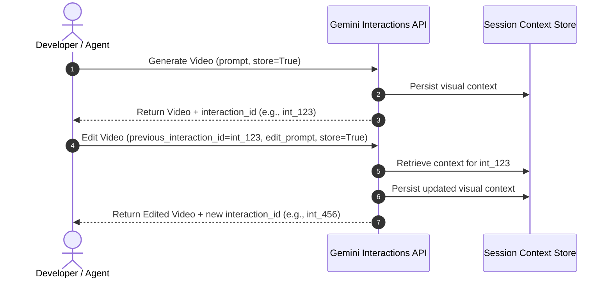

# 🎬 Gemini Interactions API Reference — Video

The **Interactions API** is the next-generation stateful endpoint for Gemini's multi-turn models. Unlike stateless generations, interactions allow you to store and iteratively refine context—enabling stateful video editing with `gemini-omni-flash-preview` (Omni Flash).

---

## 🏗️ Stateful vs. Stateless Architecture

Traditional video generation models are completely stateless: every change requires submitting a brand new text prompt and starting from scratch, losing scene consistency, character continuity, and stylistic alignment.

With the **Interactions API**:
1. **The Core Generation**: Generates an initial video and returns a unique `interaction_id` representing that session's state on Google's servers.
2. **Context Persistence**: When editing, you pass the `previous_interaction_id`. The model retrieves the precise context from your previous turn.
3. **Refinement**: It applies your natural language edit onto the existing scene, maintaining continuity (same characters, setting, lighting, camera language, and style).



---

## 🎥 Gemini Omni Flash (`gemini-omni-flash-preview`) Cheat Sheet

Gemini Omni Flash (`gemini-omni-flash-preview`) is a video generation model designed for fast, high-fidelity generation and stateful editing.

### 🔑 Essential Parameters

| Parameter | Type | Description |
| :--- | :--- | :--- |
| **`model`** | `str` | `"gemini-omni-flash-preview"` (the server reads `GEMINI_OMNI_MODEL`). |
| **`input`** | `str` \| `list` | Text prompt, or a list mixing parts: `{"type": "image", "data": <b64>, "mime_type": ...}` for local images, `{"type": "document", "uri": ...}` for a File-API-uploaded video, and `{"type": "text", "text": ...}`. |
| **`response_format`** | `dict` | `{"type": "video"}`. Supports `"aspect_ratio"`: `"16:9"` or `"9:16"` (generation only — stateful edits inherit it). Add `"delivery": "uri"` for File API delivery of large outputs. |
| **`previous_interaction_id`** | `str` | Performs stateful video editing/refinement on a prior turn. Chain the **latest** turn's ID — a stale ID silently forks from an older state. |
| **`store`** | `bool` | Set to `True` to allow subsequent stateful edits. |
| **`background`** | `bool` | `False` blocks until the video is ready (how the MCP server calls it). |

### 📦 Delivery Modes

- **inline** (default): the response carries the video as base64 in `interaction.output_video.data`. Simple, but subject to payload limits — use for short clips under ~4 MB.
- **uri** (`response_format["delivery"] = "uri"`): the video lands on the **Google File API** and `interaction.output_video.uri` points at it. Poll `client.files.get(...)` until the file's state is `ACTIVE`, then `client.files.download(...)`. Recommended for anything long or high-motion.

### 🐍 Python SDK Example

```python
import base64
from google import genai

client = genai.Client()

# 1. Generate an initial video
interaction = client.interactions.create(
    model="gemini-omni-flash-preview",
    input="A tracking shot of a red fox running through fresh snow at golden hour",
    response_format={"type": "video", "aspect_ratio": "16:9"},
    background=False,
    store=True,
)
with open("fox.mp4", "wb") as f:
    f.write(base64.b64decode(interaction.output_video.data))

# 2. Stateful Edit: modify the existing video
edited = client.interactions.create(
    model="gemini-omni-flash-preview",
    previous_interaction_id=interaction.id,
    input="Make it nighttime with heavy snowfall",
    response_format={"type": "video"},
    background=False,
    store=True,
)

# 3. Animate a local image (in-line base64 upload)
with open("portrait.png", "rb") as f:
    b64_data = base64.b64encode(f.read()).decode("utf-8")

animated = client.interactions.create(
    model="gemini-omni-flash-preview",
    input=[
        {"type": "image", "data": b64_data, "mime_type": "image/png"},
        {"type": "text", "text": "The subject turns and smiles as the camera slowly zooms in"},
    ],
    response_format={"type": "video"},
    background=False,
    store=True,
)

# 4. Edit an existing local video (File API upload + document part)
video_file = client.files.upload(file="clip.mp4")
while video_file.state == "PROCESSING":
    video_file = client.files.get(name=video_file.name)

restyled = client.interactions.create(
    model="gemini-omni-flash-preview",
    input=[
        {"type": "document", "uri": video_file.uri},
        {"type": "text", "text": "Make it a Pixar animation style"},
    ],
    response_format={"type": "video", "delivery": "uri"},
    background=False,
    store=True,
)
```

Multiple image parts compose naturally: two images + a transition prompt yields keyframe interpolation; several subject reference images + a scene prompt yields subject-consistent generation.

---

## 🛠️ Mapping API Concepts to the MCP Server

The tools in this repository wrap the raw Python SDK calls for direct tool-use by LLM agents:

### 1. Model Selection
The server abstracts model naming with the `GEMINI_OMNI_MODEL` environment variable (defaulting to `"gemini-omni-flash-preview"`), so newer model revisions can be tested without code changes.

### 2. File Persistence
Responses are saved as `<prefix>_<unix-timestamp>.mp4` in the server's working directory (`gen_`, `edit_`, `animated_`, `interpolation_`, `subject_`, `user_edit_`). In `uri` delivery mode the server polls the File API (up to 5 minutes) until the output is `ACTIVE` and then downloads it.

### 3. Input Encoding
Local images are base64-encoded with mime type inferred from the extension (png/jpg/webp). Local videos are uploaded through the Gemini File API and referenced as `document` parts.

### 4. Diagnostics & Errors
The server exposes a `get_help` tool with the full tool reference, delivery-mode guidance, and cinematic prompting tips. Tool failures are returned as `🔴 ...` text strings rather than protocol errors, so callers must check for them before reporting success. The Gemini client is constructed at startup — without `GEMINI_API_KEY`/`GOOGLE_API_KEY` in the environment the server fails to launch.

---

## 💡 Best Practices for Video Prompting & Stateful Editing

* **Specify `store=True`**: Always set `store=True` (the MCP tools do) if you plan to do multi-turn editing.
* **Prompt cinematically**: describe scene layout, subject action, camera motion (pan, tracking shot, crane shot, slow zoom), lighting/mood (golden hour, neon glow, moody shadows), and style (photorealistic, Pixar-style, macro, 2D flat design).
* **Keep edit prompts incremental**: focus only on the change (`"make it nighttime with rain"`) rather than repeating the whole scene — the stored context holds the rest.
* **Pick the aspect ratio at generation time**: `16:9` or `9:16`; stateful edits inherit it.
* **Prefer `uri` delivery for large outputs**: inline base64 responses can fail on clips over ~4 MB.
* **Budget for latency and cost**: video generations block until ready and are billable — batch related edits into one well-specified prompt.

---

## 🔗 Useful Links
- [Interactions API Reference Guide](https://ai.google.dev/api/interactions-api)
- [Raw Interactions API Details](https://ai.google.dev/api/interactions.md.txt)
- [Gemini Omni prompting guide](https://deepmind.google/models/gemini-omni/prompt-guide/)
- [Project repository](https://github.com/xbill9/omni-skill-agy) — the `omni-video-agent` MCP server ([server.py](server.py)), the `omni-video` skill ([SKILL.md](SKILL.md)), and setup docs ([README.md](README.md))
